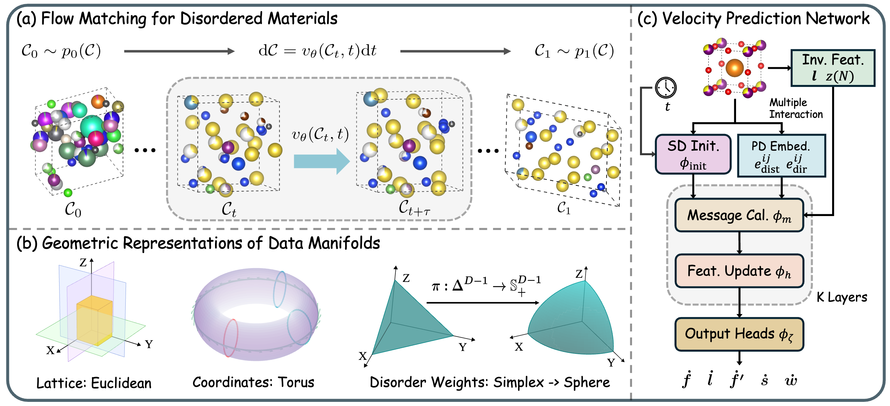

# DMFlow: Disordered Materials Generation by Flow Matching

<div align="center">
<a href="https://openreview.net/forum?id=kOVqhfeUgI"></a>
<a href="https://arxiv.org/abs/2602.04734"></a>
<!-- <br> -->
<a href="https://www.python.org/"></a>
<a href="https://pytorch.org/"></a>
<a href="LICENSE.md"></a>
</div>


## Overview
DMFlow is a Riemannian flow-matching codebase for crystal structure prediction
and de novo generation of disordered materials. It includes training,
sampling, and evaluation workflows for
substitutional and positional disorder.
<div align="center">

</div>

## Installation

```bash
git clone https://github.com/GLAD-RUC/DMFlow.git
cd DMFlow
bash scripts/prepare_env.sh <env_name>
conda activate <env_name>
```

`env_name` is the name of the conda environment to create or update. It defaults
to `dmflow` when omitted.

## Repository Layout

```
scripts/                            # shell launchers (train, generation, evaluation)
data/                               # CSV splits and preprocessing utilities
remote/                             # pinned third-party submodules
conf/                               # Hydra configs
├── default.yaml
├── data/                           # dataset configs
├── model/                          # model objective configs
└── vectorfield/                    # vector field configs
dmflow/
├── run.py                          # training entry point
├── evaluate.py                     # reconstruction, generation, consolidation, metrics CLI
├── model/
│   ├── arch.py                     # model architecture
│   ├── model_pl.py                 # PyTorch Lightning module
│   ├── solvers.py                  # ODE solvers
│   ├── standardize.py              # data standardization
│   ├── eval_utils.py               # evaluation utilities
│   └── stats/                      # dataset/manifold normalization YAMLs
├── rfm/
│   ├── manifolds/                  # Riemannian manifold definitions
│   ├── manifold_getter.py
│   └── vmap.py
├── data/
│   ├── dataset.py                  # dataset class
│   ├── datamodule.py               # Lightning data module
│   ├── disorder_utils.py           # disorder-specific utilities
│   ├── eval_utils.py               # evaluation data utilities
│   ├── csv_to_cache.py             # CSV → cached .pt conversion
│   └── cache_to_csv.py
├── utils/                          # shared helpers (CHGNet, pymatgen, matminer, …)
└── old_eval/                       # legacy evaluation code
```

## Data

Dataset CSV files are tracked with [Git LFS](https://git-lfs.com/). If the
CSV files were not downloaded during clone, install Git LFS first and then pull
them inside the repository:

```bash
sudo apt install git-lfs
git lfs install
git lfs pull
```

The release configs use disorder datasets under `data/disorder/`:

- `data/disorder/cod/sd`: substitutional-disorder COD split.
- `data/disorder/cod/spd`: substitutional and positional-disorder COD split.
- `data/disorder/cod_20/sd`: SD subset with at most 20 sites.
- `data/disorder/cod_20/spd`: SPD subset with at most 20 sites.

The first training run converts each CSV split into cached `.pt` files.

## Training

```bash
bash scripts/train_model.sh <task> <dataset> [run_name]
```

| Parameter | Description | Options / Default |
|-----------|-------------|-------------------|
| `<task>` | Task type (required) | `csp`, `dng` |
| `<dataset>` | Dataset name (required) | `cod_sd_20`, `cod_spd_20`, `cod_sd`, `cod_spd` |
| `[run_name]` | W&B run name (optional) | Default: `dmflow_<dataset>_<task>` |

**Example:**

```bash
GPUS=0,1 bash scripts/train_model.sh csp cod_sd_20
```

Dataset- and task-specific defaults live in Hydra configs under
`data.train_model`.

**Optional environment variables:**

| Variable | Description | Default |
|----------|-------------|---------|
| `GPUS` | Comma-separated GPU ids | dataset/task config default |
| `EPOCHS` | Number of training epochs | dataset config default |
| `LR` | Learning rate override | dataset/task config default |
| `BATCH_SIZE` | Train and validation batch size override | dataset/task config default |
| `CKPT_PATH` | Checkpoint path for model weight loading | empty |
| `RESUME_FROM_CHECKPOINT` | Lightning resume flag | `False` |

## Sampling and Evaluation

```bash
# Step 1: Generate / reconstruct
bash scripts/generation.sh <task> /path/to/checkpoint.ckpt <eval_name>

# Step 2: Compute metrics
bash scripts/evaluation.sh /path/to/checkpoint.ckpt <eval_name>
```

| Parameter | Description | Options |
|-----------|-------------|---------|
| `<task>` | Task type | `csp`, `dng` |
| `/path/to/checkpoint.ckpt` | Path to trained checkpoint | - |
| `<eval_name>` | Subdirectory for this evaluation | e.g. `csp_eval`, `gen_eval` |

**Example:**

```bash
# CSP
GPUS=0,1 bash scripts/generation.sh csp /path/to/ckpt.ckpt csp_eval
bash scripts/evaluation.sh /path/to/ckpt.ckpt csp_eval

# DNG
GPUS=0,1,2,3 bash scripts/generation.sh dng /path/to/ckpt.ckpt gen_eval
bash scripts/evaluation.sh /path/to/ckpt.ckpt gen_eval
```

**Optional environment variables:**

| Variable | Description | Default |
|----------|-------------|---------|
| `GPUS` | Comma-separated GPU ids | all visible GPUs |
| `SLOPE` | Inference annealing slope | `20.0` |
| `STAGE` | Data split for generation and metrics | `test` |
| `BATCH_SIZE` | Evaluation batch size | task default |
| `NUM_SAMPLES` | DNG generation sample count | `10000` |
| `LOG_WANDB` | Set to `1` to log metrics to W&B | `0` |


## Citation

If you find DMFlow useful, please cite our paper:

```bibtex
@inproceedings{
wu2026dmflow,
title={{DMF}low: Disordered Materials Generation by Flow Matching},
author={Liming Wu and Rui Jiao and Qi Li and Mingze Li and Songyou Li and Shifeng Jin and Wenbing Huang},
booktitle={32nd SIGKDD Conference on Knowledge Discovery and Data Mining - AI for Sciences Track},
year={2026}
}
```

## Contact

If you have any questions, feedback, or collaboration ideas, feel free to reach out: `wlm155@126.com`.

## License and Credits

This repository is built on top of
[FlowMM](https://github.com/facebookresearch/flowmm). We thank the FlowMM
authors for releasing their codebase. DMFlow is released under the Creative
Commons Attribution-NonCommercial 4.0 International license to align with its
FlowMM-derived code. See `LICENSE.md`. Third-party submodules under `remote/`
retain their own licenses and attribution requirements.
